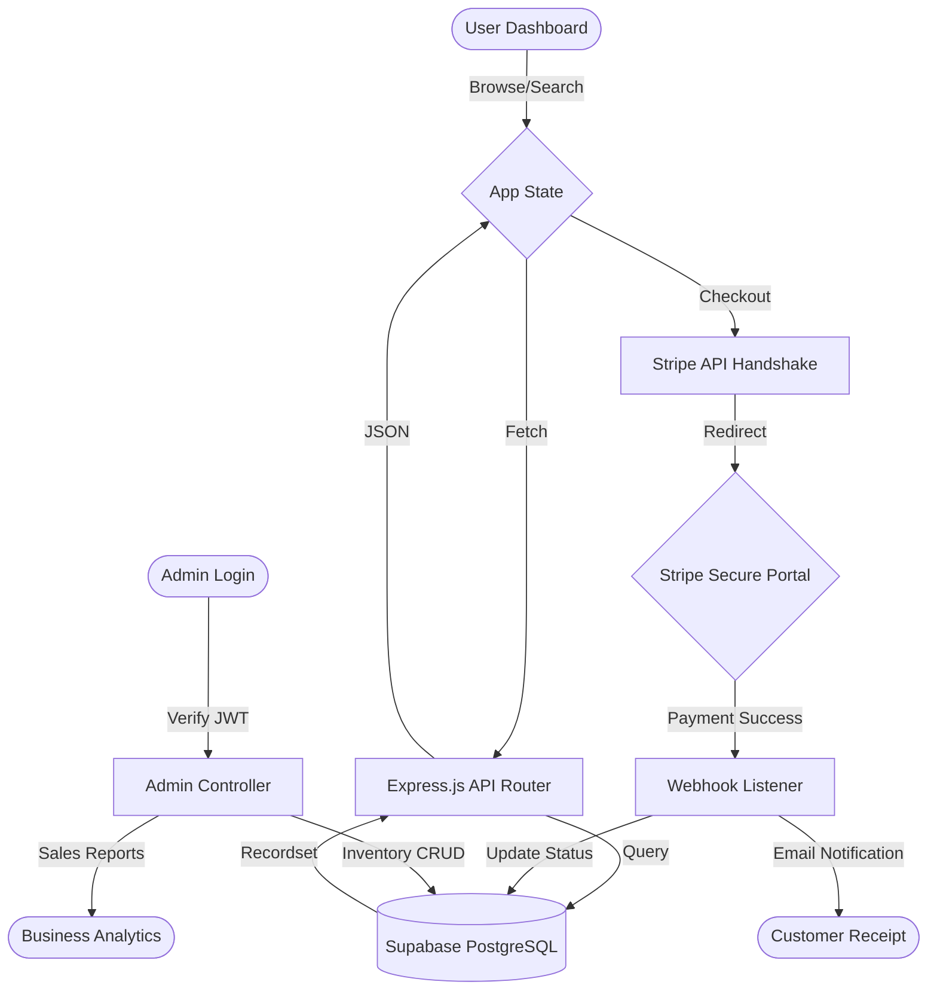
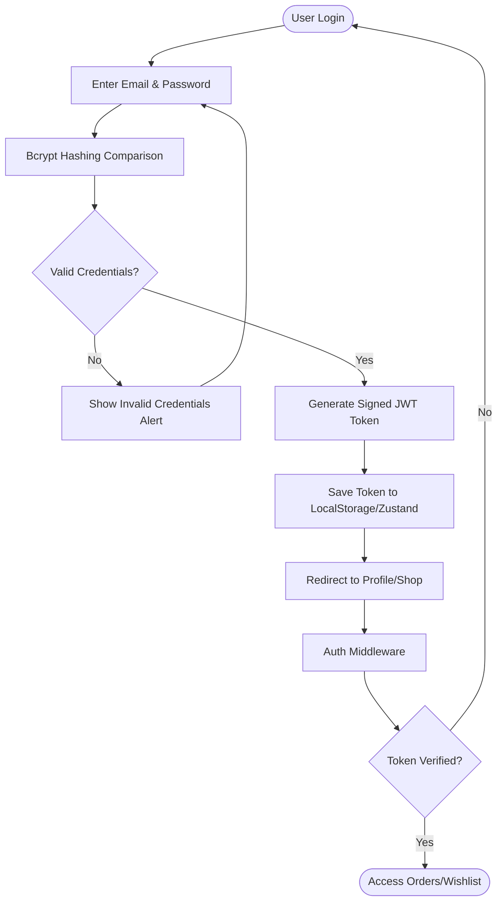
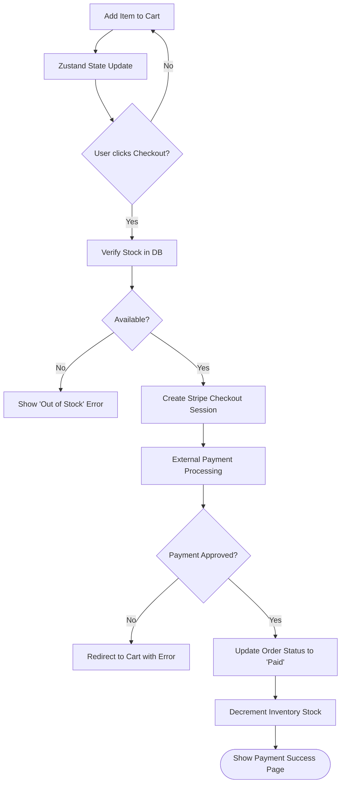
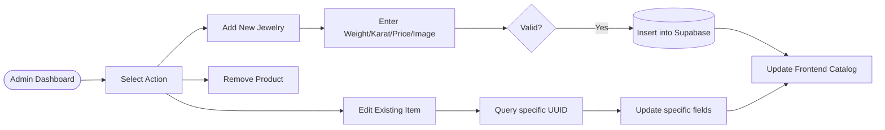

# 📊 YUKTA JEWELLERY SHOP - SYSTEM FLOWCHARTS

This document contains the detailed logical workflows of the Yukta Jewellery project. These diagrams use Mermaid syntax and can be rendered by GitHub, VS Code, or moved to [Mermaid Live Editor](https://mermaid.live/) for high-resolution exports.

---

## 1. Unified System Workflow (Overall Architecture)
This flowchart represents the high-level movement of data between the User, the API, and the external services.

---

## 2. Secure User Authentication Flow
This describes the logic protecting the "Digital Vault" of the user.

---

## 3. The Precision Purchase Flow (Checkout Logic)
This describes how the system handles the transition from jewelry selection to financial confirmation.

---

## 4. Admin Inventory Management Flow
This describes the internal logic used by the shop owner to maintain the digital showroom.

